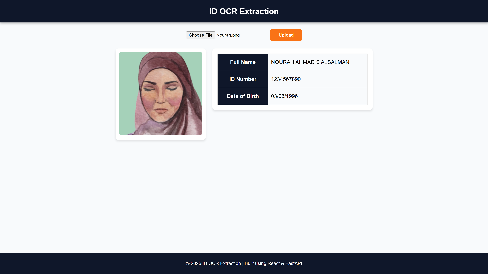
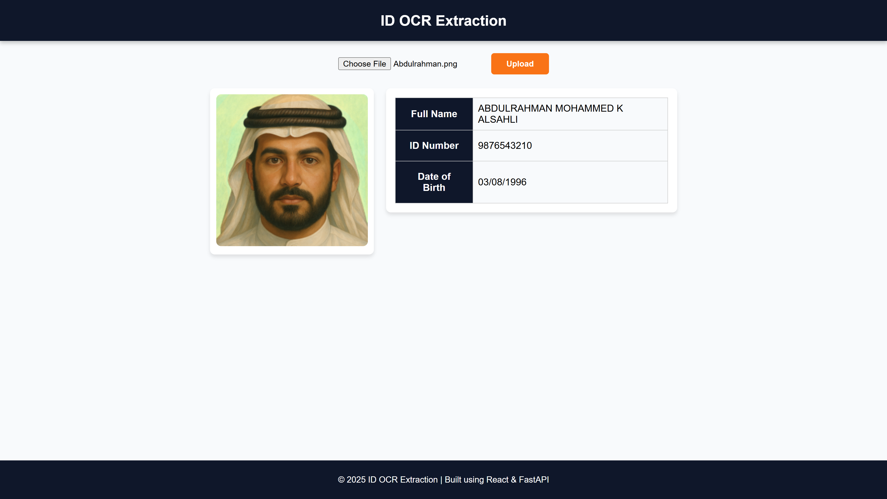

# 🆔 National ID OCR

A full-stack application that extracts personal information and detects faces from national ID images using OCR (Optical Character Recognition).  
Built with **FastAPI**, **React**, and **SQLite**.

---

## Features
- Upload a national ID image
- Extract:
  - Full Name
  - ID Number
  - Date of Birth
- Detect face from the ID
- Store extracted data in a database
- User-friendly frontend built with React

---

## 🛠 Tech Stack

**Backend:**
- [Python 3.x](https://www.python.org/)
- [FastAPI](https://fastapi.tiangolo.com/) - API framework
- [Tesseract OCR](https://github.com/tesseract-ocr/tesseract) - Text recognition
- [OpenCV](https://opencv.org/) - Face detection
- [SQLAlchemy](https://www.sqlalchemy.org/) + SQLite - Database

**Frontend:**
- [React](https://react.dev/) - UI framework
- [Axios](https://axios-http.com/) - API requests
- CSS - Styling

**Database:**
- SQLite
---

### Setup Instructions

### 1. Clone the Repository
```bash
git clone https://github.com/Duwaysan/National_ID_OCR.git
cd National_ID_OCR
```
### 2. Backend Setup
```bash
cd backend
python -m venv venv
venv\Scripts\activate   # Windows
pip install -r requirements.txt
```
### 3. Frontend Setup
```bash
cd ../frontend
npm install
npm install concurrently --save-dev
```
### 4. Run Both Backend & Frontend Together
```bash
npm run dev
```

---

## **6️⃣ API Documentation**
Base URL: http://127.0.0.1:8000

```md


### **POST /upload-id/**
Uploads an image of a national ID card, extracts full name, ID number, date of birth, and detects the face.
Prevents duplicate IDs from being saved.
**Request:**
- Method: POST
- Content-Type: multipart/form-data
- Body: `file` (image file .jpg/.png)

**Response Example:**
```json
{
  "id_number": "1234567890",
  "full_name": "KHALID ABDULAZIZ S ALDUWAYSAN",
  "dob": "06/12/2002",
  "face_image": "/9j/4AAQSkZJRgABAQAAAQABAAD...(stored as base64)",  
}
```

## **7️⃣ Assumptions & Limitations**
```md
## Assumptions & Limitations
- Works best with high-quality scanned ID images
- OCR accuracy may vary depending on image quality
- Only detects faces on the **left side** of the ID
- Currently optimized for Saudi National IDs
- Currently supports **only English** text recognition from National ID cards.
- Currently uses **SQLite**; can be upgraded to PostgreSQL or MySQL
```


> **Note:**  
> If you have already uploaded the sample ID images that are included in the repository,  
> they are already stored in the database.  
> To start fresh and avoid duplicate ID errors, **delete the database file** before running:
> ```
> backend/data/database.db
> ```
> The database will be recreated automatically when you run the backend.
